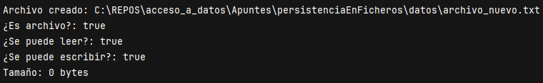
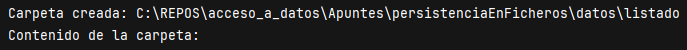
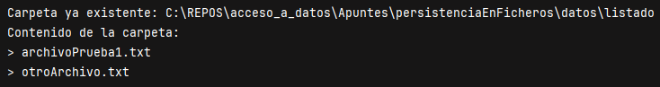

# Tema 2: Gestión de Ficheros y Directorios con la Clase File

**Descripción**  
Este tema aborda el uso de la clase `File` del paquete `java.io`, fundamental para gestionar archivos y carpetas en Java. Aprenderemos a crear, renombrar, eliminar y comprobar la existencia de ficheros, así como a explorar directorios.

## Introducción

Java proporciona la clase `File` para representar rutas de archivos y directorios. A través de esta clase es posible interactuar con el sistema de archivos de manera portable y segura. Aunque la clase `File` no permite leer ni escribir contenido directamente, sí facilita la gestión del sistema de ficheros.

Por ejemplo, permite:

- Comprobar si un archivo o carpeta existe.
    
- Crear nuevos archivos o carpetas.
    
- Eliminar elementos del sistema de ficheros.
    
- Consultar el nombre, tamaño, ruta o permisos de un archivo.

## Gestión de archivos con `java.io.File`

### 1. Crear una ruta con File

```java
File archivo = new File("datos/ejemplo.txt");
```

Esto no crea el archivo en sí, solo **representa** esa ruta. El archivo puede existir o no.

### 2. Métodos útiles para archivos

```java
archivo.exists();         // ¿Existe el archivo?
archivo.createNewFile();  // Crea el archivo si no existe
archivo.delete();         // Elimina el archivo
archivo.getName();        // Nombre del archivo
archivo.getPath();        // Ruta relativa
archivo.getAbsolutePath(); // Ruta absoluta
archivo.length();         // Tamaño en bytes
archivo.canRead();        // ¿Tiene permiso de lectura?
archivo.canWrite();       // ¿Tiene permiso de escritura?
```

### Ejemplo: Gestión de un archivo

```java
import java.io.File;
import java.io.IOException;

public class GestionArchivo {
    public static void main(String[] args) {
        try {
            File archivo = new File("datos/archivo_nuevo.txt");

            if (!archivo.exists()) {
                archivo.createNewFile();
                System.out.println("Archivo creado: " + archivo.getAbsolutePath());
            } else {
                System.out.println("Ya existe: " + archivo.getAbsolutePath());
            }

            System.out.println("¿Es archivo?: " + archivo.isFile());
            System.out.println("¿Se puede leer?: " + archivo.canRead());
            System.out.println("¿Se puede escribir?: " + archivo.canWrite());
            System.out.println("Tamaño: " + archivo.length() + " bytes");

        } catch (IOException e) {
            System.out.println("Error: " + e.getMessage());
        }
    }
}
```
> 

### 3. Gestión de directorios

```java
File carpeta = new File("datos/nueva_carpeta");
carpeta.mkdir();         // Crea la carpeta
carpeta.exists();        // ¿Existe?
carpeta.isDirectory();   // ¿Es un directorio?
```

Para listar archivos dentro de una carpeta:

```java
String[] lista = carpeta.list();
for (String nombre : lista) {
    System.out.println(nombre);
}
```

### Ejemplo: Listado del contenido de una carpeta

```java
import java.io.File;

public class GestionCarpeta {
    public static void main(String[] args) {
        File carpeta = new File("datos/listado");

        if (!carpeta.exists()) {
            carpeta.mkdir();
            System.out.println("Carpeta creada: " + carpeta.getAbsolutePath());
        } else {
            System.out.println("Carpeta ya existente: " + carpeta.getAbsolutePath());
        }

        File[] contenido = carpeta.listFiles();
        System.out.println("Contenido de la carpeta:");
        if (contenido != null) {
            for (File f : contenido) {
                System.out.println("> " + f.getName() + (f.isDirectory() ? " (dir)" : ""));
            }
        }
    }
}
```

> 

Pruebo a crear archivos dentro de la carpeta

> 

## Resumen

La clase `File` permite gestionar archivos y directorios del sistema operativo desde Java. Aunque no permite leer o escribir contenido, sí es muy útil para realizar operaciones como crear carpetas, comprobar permisos o eliminar elementos del sistema.

---

## Tabla resumen de métodos comunes

|Método|Descripción|
|---|---|
|`exists()`|Comprueba si el archivo/carpeta existe|
|`createNewFile()`|Crea un nuevo archivo|
|`mkdir()`|Crea un nuevo directorio|
|`delete()`|Elimina el archivo o directorio|
|`isDirectory()`|¿Es un directorio?|
|`isFile()`|¿Es un archivo?|
|`getName()`|Devuelve el nombre del archivo|
|`getAbsolutePath()`|Devuelve la ruta absoluta|
|`length()`|Tamaño en bytes|
|`canRead()`|¿Tiene permiso de lectura?|
|`canWrite()`|¿Tiene permiso de escritura?|

> [!Actividad 2.1]
> https://github.com/IrisCampusFP/ActividadesAccesoADatos/tree/main/UD1-Persistencia_en_Ficheros/T2.1-Gestion_de_archivos_y_directorios_con_File