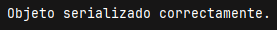
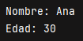

**Descripción**  
Este tema se centra en el tratamiento de ficheros binarios y en la serialización de objetos en Java, permitiendo guardar estructuras complejas (como listas, objetos y árboles) en disco y recuperarlas más tarde.

## Introducción

Cuando se desea guardar información más estructurada que simples cadenas de texto, una opción eficiente es utilizar ficheros binarios. En estos archivos los datos se guardan en formato no legible para humanos, pero mucho más eficiente para la lectura/escritura por parte del programa.

Además, Java permite guardar objetos completos mediante un proceso llamado **serialización**, que convierte un objeto en una secuencia de bytes para almacenarlo o enviarlo a través de la red.

## ¿Qué es la serialización?

La serialización es el proceso mediante el cual un objeto en memoria se transforma en una secuencia de bytes que puede guardarse en un fichero o transmitirse. Su operación inversa es la **deserialización**, que reconstruye el objeto original a partir del flujo de datos.

Para que una clase sea serializable debe:

- Implementar la interfaz `java.io.Serializable`.
    
- Tener un identificador `serialVersionUID` (recomendado).

## Escritura de objetos (serialización)

```java
import java.io.*;

public class EscribirObjeto {
    public static void main(String[] args) {
        Persona p = new Persona("Ana", 30);

        try (ObjectOutputStream oos = new ObjectOutputStream(new FileOutputStream("datos/persona.dat"))) {
            oos.writeObject(p);
            System.out.println("Objeto serializado correctamente.");
        } catch (IOException e) {
            System.out.println("Error al escribir objeto: " + e.getMessage());
        }
    }
}

class Persona implements Serializable {
    private static final long serialVersionUID = 1L;
    private String nombre;
    private int edad;

    public Persona(String nombre, int edad) {
        this.nombre = nombre;
        this.edad = edad;
    }
}
```

> 

(Se ha creado el objeto serializado en la carpeta datos)

> 

## Lectura de objetos (deserialización)

```java
import java.io.*;

public class LeerObjeto {
    public static void main(String[] args) {
        try (ObjectInputStream ois = new ObjectInputStream(new FileInputStream("datos/persona.dat"))) {
            Persona p = (Persona) ois.readObject();
            System.out.println("Nombre: " + p.getNombre());
            System.out.println("Edad: " + p.getEdad());
        } catch (IOException | ClassNotFoundException e) {
            System.out.println("Error al leer objeto: " + e.getMessage());
        }
    }
}
```

> 

## Ventajas de la serialización

- Permite almacenar el estado completo de objetos complejos.
    
- Muy útil para guardar listas, colecciones y objetos anidados.
    
- Fácil de implementar con `ObjectOutputStream` y `ObjectInputStream`.

## Consideraciones

- Todos los objetos incluidos deben ser también `Serializable`.
    
- No se deben serializar objetos con conexiones abiertas, hilos, etc.
    
- Puede romperse la compatibilidad si cambia la estructura de la clase.

---

## Tabla resumen

|Clase|Descripción|
|---|---|
|`Serializable`|Interfaz que marca una clase como serializable|
|`ObjectOutputStream`|Permite escribir objetos en un flujo binario|
|`ObjectInputStream`|Permite leer objetos desde un flujo binario|
|`writeObject(obj)`|Serializa un objeto y lo guarda en el archivo|
|`readObject()`|Recupera el objeto previamente serializado|