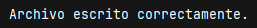
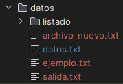
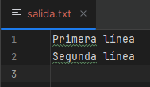
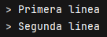

# Tema 3: Lectura y Escritura Secuencial de Ficheros

**Descripción**  
Este tema se centra en las operaciones básicas de lectura y escritura secuencial sobre archivos de texto en Java. Utilizaremos las clases `FileReader`, `BufferedReader`, `FileWriter` y `BufferedWriter` para manipular datos de manera eficiente.

## Introducción

La lectura y escritura secuencial implica acceder a un archivo desde el principio hasta el final, en orden. Es el modo más habitual para trabajar con archivos de texto donde se procesan líneas completas o caracteres de forma lineal.

Java proporciona diferentes clases dentro del paquete `java.io` para realizar estas tareas de forma eficiente, utilizando buffers que reducen el acceso físico al disco y mejoran el rendimiento.

## Escritura secuencial de ficheros

Para escribir texto en un archivo utilizamos:

- `FileWriter`: conecta el programa con el archivo.
    
- `BufferedWriter`: permite escribir texto en bloque (más eficiente).

### Ejemplo

```java
import java.io.*;

public class EscrituraFichero {
    public static void main(String[] args) {
        try {
            FileWriter fw = new FileWriter("datos/salida.txt");
            BufferedWriter bw = new BufferedWriter(fw);

            bw.write("Primera línea");
            bw.newLine();
            bw.write("Segunda línea");
            bw.newLine();

            bw.flush(); // Forzar la escritura
            bw.close(); // Cerrar el buffer

            System.out.println("Archivo escrito correctamente.");
        } catch (IOException e) {
            System.out.println("Error al escribir: " + e.getMessage());
        }
    }
}
```

> 

(Se ha creado el archivo salida.txt en la carpeta datos)

>          

## Lectura secuencial de ficheros

Para leer archivos línea a línea:

- `FileReader`: abre el archivo.
    
- `BufferedReader`: permite leer una línea completa con `readLine()`.

### Ejemplo

```java
import java.io.*;

public class LecturaFichero {
    public static void main(String[] args) {
        try {
            FileReader fr = new FileReader("datos/salida.txt");
            BufferedReader br = new BufferedReader(fr);

            String linea;
            while ((linea = br.readLine()) != null) {
                System.out.println("> " + linea);
            }

            br.close();
        } catch (IOException e) {
            System.out.println("Error al leer: " + e.getMessage());
        }
    }
}
```

> 

## Consideraciones importantes

- Siempre cerrar los streams (`close()`).
    
- Utilizar `try-catch` para capturar errores de entrada/salida.
    
- `flush()` garantiza que lo que está en el buffer se escribe en disco.
    
- Las rutas deben existir o crearse antes de escribir.

Usar `newLine()` en lugar de `\n` asegura compatibilidad multiplataforma.

## Resumen

Este tema ha presentado las clases necesarias para realizar escritura y lectura secuencial de archivos de texto en Java. Estas operaciones son fundamentales para guardar o recuperar datos simples en forma de texto plano.

---
## Tabla comparativa

|Clase|Función|
|---|---|
|`FileWriter`|Escribe caracteres en un archivo|
|`BufferedWriter`|Mejora el rendimiento usando un buffer|
|`FileReader`|Lee caracteres desde un archivo|
|`BufferedReader`|Permite leer líneas completas eficientemente|

> [!Actividad 3.1]
> https://github.com/IrisCampusFP/ActividadesAccesoADatos/tree/main/UD1-Persistencia_en_Ficheros/T3.1-Lectura_y_Escritura