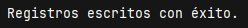
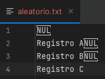

# Tema 4: Acceso Aleatorio a Ficheros

**Descripción**  
Este tema trata sobre cómo acceder a posiciones específicas dentro de un archivo utilizando la clase `RandomAccessFile` de Java. Este tipo de acceso es ideal cuando se necesita leer o escribir en ubicaciones concretas sin procesar todo el archivo secuencialmente.

## Introducción

A diferencia del acceso secuencial, el acceso aleatorio permite mover un puntero directamente a una posición determinada dentro del archivo. Esto es útil cuando trabajamos con registros de longitud fija o necesitamos modificar información puntual sin recorrer el archivo completo.

La clase `RandomAccessFile` ofrece métodos para leer y escribir datos primitivos en posiciones arbitrarias.

## Creación y escritura en un archivo aleatorio

`RandomAccessFile` permite abrir un archivo en modo lectura (`"r"`) o lectura/escritura (`"rw"`). Podemos usar `seek(long pos)` para movernos por el archivo y `writeXXX()` o `readXXX()` para trabajar con datos.

### Ejemplo: Escribir varias líneas

```java
import java.io.*;

public class EscribirAleatorio {
    public static void main(String[] args) {
        try {
            RandomAccessFile raf = new RandomAccessFile("datos/aleatorio.txt", "rw");

            raf.writeUTF("Registro A");
            raf.writeUTF("Registro B");
            raf.writeUTF("Registro C");

            raf.close();
            System.out.println("Registros escritos con éxito.");
        } catch (IOException e) {
            System.out.println("Error: " + e.getMessage());
        }
    }
}
```

> 

> 

## Lectura desde una posición específica

Podemos acceder directamente a cualquier posición del archivo utilizando `seek(pos)`.

### Ejemplo: Leer desde una posición concreta

```java
import java.io.*;

public class LeerAleatorio {
    public static void main(String[] args) {
        try {
            RandomAccessFile raf = new RandomAccessFile("datos/aleatorio.txt", "r");

            raf.seek(0); // leer desde el principio
            System.out.println("Primer registro: " + raf.readUTF());

            raf.seek(raf.getFilePointer()); // continuar donde se quedó
            System.out.println("Segundo registro: " + raf.readUTF());

            raf.close();
        } catch (IOException e) {
            System.out.println("Error: " + e.getMessage());
        }
    }
}
```

> 

## Consideraciones importantes

- `RandomAccessFile` no utiliza buffering, por lo que puede ser más lento para operaciones repetidas.
    
- Los métodos como `writeUTF` y `readUTF` usan un formato binario específico con encabezados de longitud.
    
- Si el archivo no existe y se abre en modo `"rw"`, se crea automáticamente.
    
- No es adecuado para archivos de texto plano sin estructura fija.

## Resumen

`RandomAccessFile` proporciona un mecanismo potente para manipular archivos binarios y trabajar con datos estructurados directamente en disco. Es especialmente útil en sistemas que requieren acceso directo a registros individuales.

---
## Tabla resumen

|Método|Descripción|
|---|---|
|`seek(pos)`|Mueve el puntero de lectura/escritura|
|`readUTF()`|Lee una cadena codificada como UTF|
|`writeUTF(String)`|Escribe una cadena codificada como UTF|
|`getFilePointer()`|Devuelve la posición actual del puntero|
|`length()`|

> [!Actividad 4.1]
> https://github.com/IrisCampusFP/ActividadesAccesoADatos/tree/main/UD1-Persistencia_en_Ficheros/T4.1-Acceso_Aleatorio_a_Ficheros
